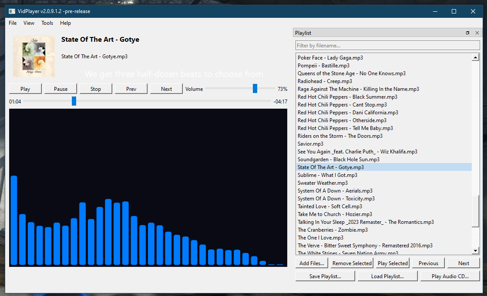
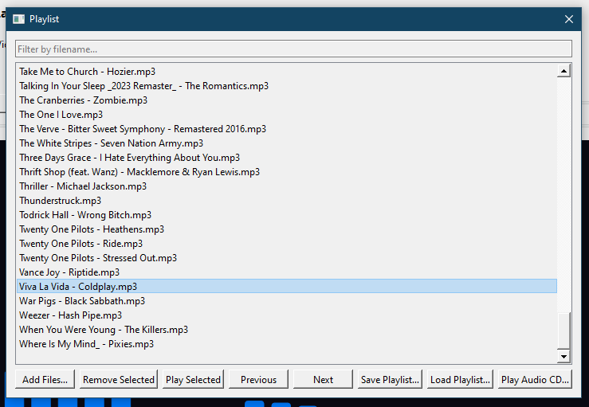
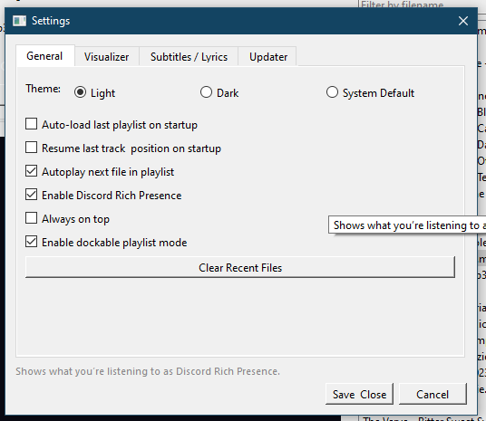
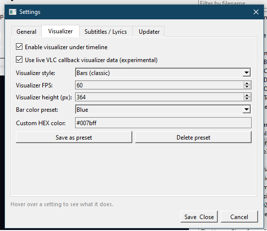
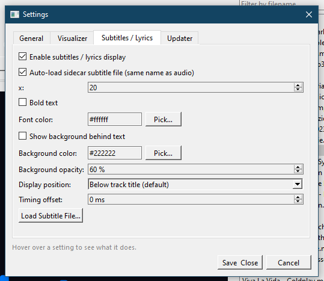
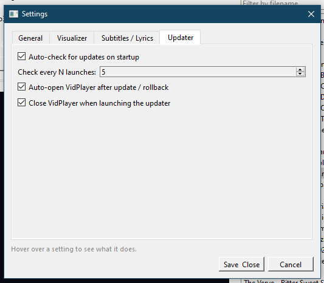
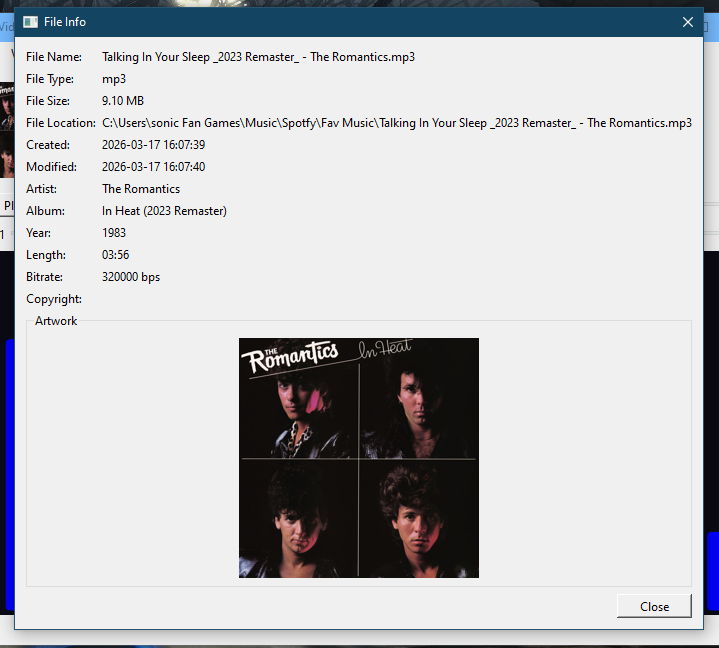
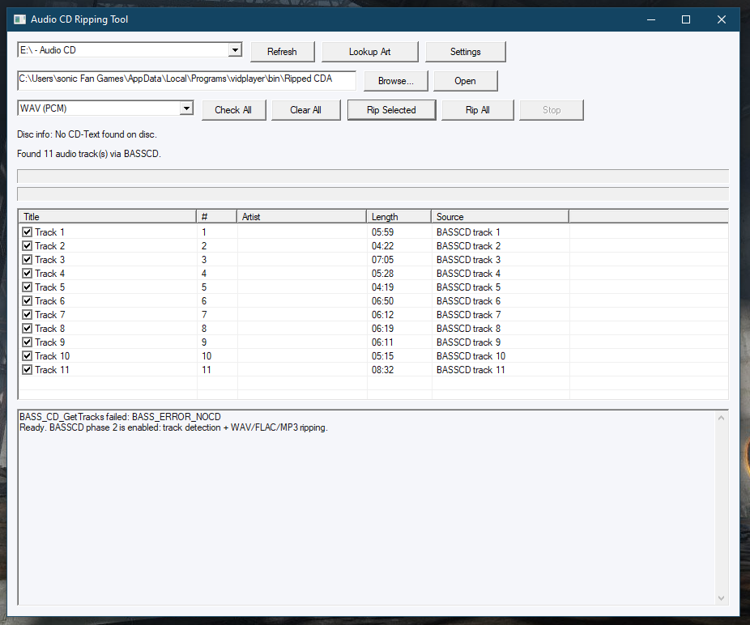

# VidPlayer


A fast, clean Windows audio player built with **Python + PySide6**, with **portable VLC playback**, **custom .ico-based UI icons**, a reworked **Full Screen Artwork** mode, a more detailed built-in **File Info** window, subtitle / lyrics support, Discord Rich Presence, and an external updater.

---

## Quick Links

- **Releases:** <https://github.com/sonicFanTech/vidplayer/releases>
- **Developer:** <https://github.com/sonicFanTech>
- **Latest update package source:** <https://github.com/sonicFanTech/customSetupInstallersPackageDownloads/releases>
- **Main feature / build log:** [CHANGELOG.md](./CHANGELOG.md)

---

## Screenshots










---

## Highlights

- Portable **VLC-based playback engine**
- Updated portable VLC runtime DLLs to **VLC 3.0.23**
- Custom **.ico-based** button and menu icon system
- Reworked **Full Screen Artwork** mode with better artwork refresh behavior
- Built-in **File Info** window with deeper media / codec details
- VPLogo placeholder support for no-artwork / no-file-loaded states
- Playlist save / load support (`.vpl` / JSON)
- Drag-and-drop audio loading
- Batch add dialog for large file imports
- Recent Files menu
- Discord Rich Presence toggle
- Subtitle / lyrics support with styling controls
- Dockable playlist mode
- Mini Mode UI
- Experimental live VLC visualizer data mode
- External updater with hash-based partial updates and rollback manifests
- External Audio CD ripper tool support


---

## Main Features

### Playback
- Portable VLC playback path for the main player
- Double-click to play supported files
- Command-line file opening support
- Resume last file / position support
- Auto-play next track option
- Always-on-top option

### Playlist
- Add, remove, reorder, save, and load playlists
- Search / filter playlist entries
- Dockable playlist mode
- Drag-and-drop support in the main window and playlist UI
- Batch loading dialog for large imports

### Artwork / Info
- Reworked Full Screen Artwork mode
- Embedded artwork support
- External artwork fallback support
- VPLogo placeholder support when no artwork is available
- File Info dialog with expanded media, container, codec, and artwork details
- Multi-file File Info list support when more than one track is loaded

### Subtitles / Lyrics
- Auto-load sidecar subtitle / lyrics files
- Manual subtitle file loading
- Font size, bold, color, background, opacity, and position controls
- Timing offset setting
- Mini Mode-safe subtitle handling

### Visualizer
- Multiple visualizer styles
- Adjustable FPS and size
- Custom color presets / HEX colors
- Experimental live VLC callback visualizer mode

### Audio CD / External Tools
- Audio CD tracks can flow through the main playlist/player path
- External Audio CD ripper tool support
- Preferred ripper executable name: `VPACDRipper.exe`
- Support for local helper tools in `bin\`

### Updater
- External updater workflow
- Python-based updater rework
- Shared updater settings file in `update\updater_settings.json`
- Hash-based partial update logic
- Preserve rules for local files
- Rollback snapshots with manifests
- Auto-launch support back into VidPlayer after update / rollback

---

## Supported Audio Formats

- `.mp3`
- `.wav`
- `.ogg`
- `.flac`
- `.m4a`
- `.aac`
- `.wma`

Some playback behavior can vary depending on codec support inside VLC.

---

## Folder Layout

A typical portable layout looks like this:

```text
VidPlayer\
├─ vidplayer.exe
├─ config.json
├─ recents.json
├─ artmap.json
├─ visualizer_presets.json
├─ bin\
│  ├─ VLCLibs\
│  │  ├─ libvlc.dll
│  │  ├─ libvlccore.dll
│  │  └─ plugins\
│  ├─ icons\
│  │  ├─ VPLogo.ico
│  │  ├─ buttons\
│  │  └─ menubar\
│  ├─ ffprobe.exe
│  ├─ ffmpeg.exe
│  └─ VPACDRipper.exe
├─ update\
│  ├─ VidPlayerUpdater.exe
│  ├─ VidPlayerUpdater.py
│  ├─ updater_settings.json
│  └─ rollbacks\
└─ Ripped CDA\
```

---

## Install / Run from Source

This section is only for running the Python source directly. If you are using a prebuilt release, you do **not** need Python installed.

### Option A — Use **pyIDE** (recommended for editing / running / building)

If you want a more guided way to work with the VidPlayer source, you can use **SFT pyIDE**, A custom Python IDE.

pyIDE is a Windows PySide6 Python IDE with:
- a tabbed editor
- interpreter selection
- two run modes
- a built-in PyInstaller compiler window
- project file tree tools
- settings, autosave, and recent files

Links:
- **pyIDE Website:** [SFT pyIDE](https://sonicfantech.org/Site/pyIDE/index.html)
- **GitHub Repository:** [sonicFanTech/pyIDE](https://github.com/sonicFanTech/pyIDE)
- **Releases:** [pyIDE v1.2.0](https://github.com/sonicFanTech/pyIDE/releases/tag/v1.2.0)

> pyIDE provides multiple language-specific installers on its release page. Pick the installer / portable build that matches the language you want.

#### 1. Install Python

VidPlayer is currently targeted at **Python 3.13.9 x64**.

Download:
- <https://www.python.org/ftp/python/3.13.9/python-3.13.9-amd64.exe>

#### 2. Install pyIDE

Download the version you want from the pyIDE release page, then install it or extract the portable version.

#### 3. Open the VidPlayer source in pyIDE

Open your VidPlayer `.py` source file in pyIDE.


#### 4. Install the required VidPlayer packages

Use pyIDE's terminal / run tools, or Command Prompt, and install the dependencies:

```bash
pip install PySide6 pygame mutagen Pillow requests pypresence python-vlc numpy py7zr
```

Notes:
- `python-vlc` is used for VLC Python bindings.
- `numpy` is used for visualizer features.
- `py7zr` is used by the Python updater, with fallback support for external 7-Zip tools when needed.


#### 5. Run VidPlayer from pyIDE

You can run VidPlayer in either of pyIDE's run modes:
- **Run inside pyIDE** for integrated output
- **Run in external console** for a real terminal window

  


Main source file example:

```bash
python vidplayer_2.0.9.1.2_PASSOVER2_portable_vlc_fixed_updater_settings.py
```

You can also pass a file directly:

```bash
python vidplayer_2.0.9.1.2_PASSOVER2_portable_vlc_fixed_updater_settings.py "D:\Music\song.mp3"
```

#### 6. Build VidPlayer to EXE with pyIDE

pyIDE includes a built-in **PyInstaller compiler window**, so you can use that to build VidPlayer and the external updater.

Example targets:

```bash
pyinstaller --noconfirm --onefile --windowed vidplayer_2.0.9.1.2_PASSOVER2_portable_vlc_fixed_updater_settings.py
```

Updater example:

```bash
pyinstaller --noconfirm --onefile --windowed VidPlayerUpdater_Python_Reworked_with_settings.py --name VidPlayerUpdater
```

**Screenshot placeholder:**

[pyIDE PyInstaller compiler window](./Screenshots/VP_pyIDE\buildwindow.png)

### Option B — Standard Python / Command Prompt workflow

If you do not want to use pyIDE, you can still run and build VidPlayer the normal way.

#### 1. Install Python

VidPlayer is currently targeted at **Python 3.13.9 x64**.

Download:
- <https://www.python.org/ftp/python/3.13.9/python-3.13.9-amd64.exe>

#### 2. Install required packages

```bash
pip install PySide6 pygame mutagen Pillow requests pypresence python-vlc numpy py7zr
```

#### 3. Run VidPlayer from source

```bash
python vidplayer_2.0.9.1.2_PASSOVER2_portable_vlc_fixed_updater_settings.py
```

You can also pass a file directly:

```bash
python vidplayer_2.0.9.1.2_PASSOVER2_portable_vlc_fixed_updater_settings.py "D:\Music\song.mp3"
```

#### 4. Build to EXE

```bash
pyinstaller --noconfirm --onefile --windowed vidplayer_2.0.9.1.2_PASSOVER2_portable_vlc_fixed_updater_settings.py
```

Updater example:

```bash
pyinstaller --noconfirm --onefile --windowed VidPlayerUpdater_Python_Reworked_with_settings.py --name VidPlayerUpdater
```

---

### Quick notes

- pyIDE is the better guided option if you want to **edit, test, and build** VidPlayer in one place.
- The standard workflow is still here if you prefer plain Python + Command Prompt.
- If you use the updater build path, make sure the built updater ends up in `update\` in your portable VidPlayer layout.

---

## Updater Notes

The newer updater system is designed to be safer for portable installs.

It supports:
- remote version checks
- package download
- hash checking
- partial update apply
- local file preserve rules
- updater-folder exclusion
- uninstaller-file exclusion
- rollback snapshots with manifests
- shared settings between VidPlayer and the updater itself

Default local-preserve behavior is intended to avoid replacing user data files like `.json` config files.

---

## Themes / UI Modes

VidPlayer supports:
- Light theme
- Dark theme
- System default theme
- Mini Mode
- Dockable playlist mode
- Full Screen Artwork mode

Older Aero Glass-era wording from previous builds has been replaced by the newer portable VLC branch and newer UI workflow.

---

## Tech Stack

- **UI:** PySide6 / Qt
- **Playback:** VLC via portable runtime DLLs
- **Metadata:** mutagen
- **Artwork:** Pillow
- **Requests / updater:** requests
- **Discord integration:** pypresence
- **Visualizer math:** numpy
- **Updater extraction:** py7zr with external 7-Zip fallback support

---

## Current Build Notes

Current README focus:
- newer portable VLC branch
- release build status
- custom .ico-based UI icon system
- reworked Full Screen Artwork behavior
- improved built-in File Info workflow
- VPLogo placeholder integration
- updater / visualizer / docking / subtitle systems carried forward from the newer branch


For the full version history, see [CHANGELOG.md](./CHANGELOG.md).

---

## Credits

Developed by **sonic Fan Tech / sonic Fan Games**

- GitHub: <https://github.com/sonicFanTech>
- Releases: <https://github.com/sonicFanTech/vidplayer/releases>

